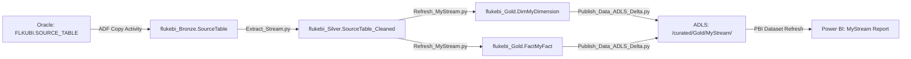
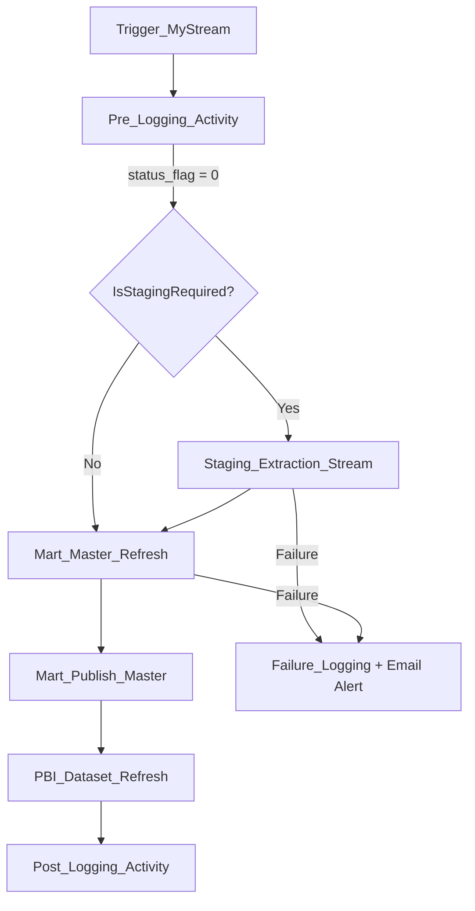

# Fluke UBI Developer Skill

You are an expert developer on the Fluke UBI (Unified Business Intelligence) platform. This skill provides the context and conventions needed to work effectively across the three core repositories.

## Access Control Rules (MANDATORY)

These rules override all other instructions. Violations are never acceptable.

1. **NEVER make changes directly in Prod or QA.** No writes, no updates, no deletes — ever.
2. **Read-only in QA and Prod.** If a write to QA or Prod is ever considered necessary, you MUST ask the user for confirmation **twice** (two separate confirmations) before proceeding.
3. **Dev work happens in Dev only.** You may read from all three environments (Dev, QA, Prod) for investigation, comparison, and context — but all code changes, data writes, pipeline modifications, and deployments target Dev exclusively.
4. **Full read/write privileges only in Dev.** Dev is the only environment where you create, modify, or delete resources.

## Task Decision Tree

```
What do you need?
├─ Create a new data stream → §New Stream Checklist (STM → Bronze → Silver → Gold → ADLS → PBI)
├─ Modify an existing stream → §Stream Modification (find notebooks by stream name, trace data flow)
├─ Debug data issues → §Troubleshooting (compare Bronze→Silver→Gold, check status_control)
├─ Create/modify ADF pipeline → §ADF Conventions (naming, parameters, triggers, ARM templates)
├─ Create/modify Power BI model → §PBI Semantic Models (dataset definitions, refresh setup)
├─ Run tests or validate changes → §TDD Workflow (gate functions, characterization tests)
└─ Investigate production data → Read-only in Prod (Access Control Rule 1), compare with Dev
```

## Repositories

### 1. AzureDataBricks (Compute Layer)
- **Local path:** `C:\Users\tmanyang\AzureDataBricks`
- **Remote:** `https://dev.azure.com/flukeit/Fluke%20Data%20And%20Analytics/_git/AzureDataBricks`
- **Branch:** `main`
- **Purpose:** Databricks notebooks implementing the Medallion Architecture (Bronze → Silver → Gold)
- **Languages:** Python (224 files), SQL (386 files), Scala (6 files)
- **Total files:** 646

### 2. ADF (Orchestration Layer)
- **Local path:** `C:\Users\tmanyang\ADF`
- **Remote:** `https://dev.azure.com/flukeit/Fluke%20Data%20And%20Analytics/_git/ADF`
- **Branch:** `Main`
- **Purpose:** Azure Data Factory pipelines, triggers, datasets, and linked services that orchestrate the Databricks notebooks
- **Resources:** 91 pipelines, 113 datasets, 31 linked services, 102 triggers

### 3. Power BI UBI Curated Datasets (Reporting Layer)
- **Local path:** `C:\Users\tmanyang\Power BI UBI Curated Datasets`
- **Remote:** `https://dev.azure.com/flukeit/Fluke%20Data%20And%20Analytics/_git/Power%20BI%20UBI%20Curated%20Datasets`
- **Branch:** `main`
- **Purpose:** Power BI semantic models (.pbix files, dataset definitions) that consume the Gold layer data for reporting and analytics
- **Power BI Workspace:** `https://app.powerbi.com/groups/a59d3713-6f5a-470e-833e-15bbf60e8c97`

## Architecture Overview

```
ADF (Orchestrator)                    Databricks (Processor)                Power BI (Reporting)
───────────────────                   ──────────────────────                ────────────────────
Triggers & Schedules          →       Notebook execution
Parameters (Stream, SubStream)→       StreamName, Database widgets
Status checks (Azure SQL)     ↔       Status updates (Azure SQL)
Source data pull (Oracle/SFTP) →       Bronze layer landing
Pipeline coordination         →       Silver/Gold transforms
Failure alerts (Logic Apps)   ←       Notebook errors
PBI Dataset Refresh           →       Published Delta/Parquet       →       Semantic models (.pbix)
                                                                            Curated datasets repo
                                                                            Reports & Dashboards
```

### Data Flow

```
Source Systems (Oracle, SFTP, APIs, BigQuery, Dataverse)
    ↓
ADF Trigger fires → Master Pipeline starts
    ↓
Pre-Logging (status_control check)
    ↓
Staging Extraction → Databricks notebooks → flukebi_Bronze
    ↓
Mart Refresh → Databricks notebooks → flukebi_Silver → flukebi_Gold
    ↓
Publish → ADLS (Parquet/Delta)
    ↓
Power BI Dataset Refresh → Semantic Models (Power BI UBI Curated Datasets repo)
    ↓
Power BI Reports & Dashboards (Workspace: a59d3713-6f5a-470e-833e-15bbf60e8c97)
    ↓
Post-Logging (status_control update)
```

## Environment Configuration

### Full Environment Map

| Resource | Dev | Test/QA | Prod |
|----------|-----|---------|------|
| **Databricks URL** | `https://adb-1943773873358740.0.azuredatabricks.net` | `https://adb-8730269443112808.8.azuredatabricks.net` | `https://adb-427149968829263.3.azuredatabricks.net` |
| **ADLS Account(s)** | `flkubiadlsdev` | `flkubiadlsqa` | `flkubiadlsprd`, `flkubiadlsprdwest` |
| **Power BI Workspace** | **FLK-BI-DEV** `6fec84af-8245-4738-b317-f29326432ae3` | **FLK-BI-QA** `7f77ddaf-78e7-471c-b104-9000eb5fd761` | **FLK-BI-PROD** `a59d3713-6f5a-470e-833e-15bbf60e8c97` |
| **Power BI Workspace 2** | — | — | **FLK-BI-PROD2** `77022434-8325-4d68-9b96-02ea76d7319d` |
| **ADF Factory** | `flkubi-adf-dev` | — | `flkubi-adf-prd` |
| **Azure SQL Server** | `etlmetadata.database.windows.net` | — | `etlmetadata-prod.database.windows.net` |
| **Azure SQL Database** | `dev` | `qa` | `prd` |
| **Key Vault Scope** | `FlukeDevKeyVault` | `flukeqaadbscope` | `flukeprdadbscope` |
| **Azure Subscription** | `52a1d076-bbbf-422a-9bf7-95d61247be4b` (Fluke Unified BI) | Same | Same |
| **PBI Tenant ID** | `0f634ac3-b39f-41a6-83ba-8f107876c692` | Same | Same |
| **Oracle Server** | `flkonv-odb01-p.oci.fluke.com:1591` | Same | Same |
| **Oracle SID** | `flkp` | `flkp` | `flkp` |
| **Oracle User** | `flkubi` | `flkubi` | `flkubi` |

### CLI Connection Quick Reference

```bash
# Azure login (device code flow — use when broker fails)
az login --tenant 0f634ac3-b39f-41a6-83ba-8f107876c692 --use-device-code
az account set --subscription 52a1d076-bbbf-422a-9bf7-95d61247be4b

# ADLS — list containers
az storage container list --account-name flkubiadlsdev --auth-mode login --query "[].name" -o tsv

# Databricks — REST API via AAD token (use Python requests to avoid MSYS path mangling)
TOKEN=$(az account get-access-token --resource 2ff814a6-3304-4ab8-85cb-cd0e6f879c1d --query accessToken -o tsv)
python -c "import requests; r=requests.get('https://adb-1943773873358740.0.azuredatabricks.net/api/2.0/workspace/list', headers={'Authorization':'Bearer TOKEN'}, json={'path':'/FlukeCoreGrowth'}); print(r.json())"

# Power BI — list datasets in a workspace
az rest --method get --url "https://api.powerbi.com/v1.0/myorg/groups/<workspace-id>/datasets" --resource "https://analysis.windows.net/powerbi/api" -o table
```

## Database Schemas (Medallion Architecture)

- **`flukebi_Bronze`** — Raw extracted data from source systems
- **`flukebi_Silver`** — Cleaned, deduplicated, conformed data
- **`flukebi_Gold`** — Business-ready analytics tables (Fact/Dim)

### Medallion Architecture Rules (Enforced for All Streams)

All streams must flow through all three layers. No skipping layers.

**Bronze (flukebi_Bronze) — Raw Landing:**
- Data arrives as close to source format as possible
- Minimal cleaning only: trim whitespace, remove currency symbols (`$`), standardize nulls
- No business logic, no joins, no aggregations
- Add metadata columns: `_load_datetime`, `_source_system`, `_pipeline_run_id`
- Full or incremental load as defined in `etl.source_control`

**Silver (flukebi_Silver) — Transform & Conform:**
- Deduplication, type casting, column renaming to standard conventions
- Business logic, calculations, derived columns
- Joins across Bronze tables (e.g., joining order lines to order headers)
- Data quality filtering (remove invalid records, apply business rules)
- Conforming to standard dimensions (date keys, customer keys, product keys)

**Gold (flukebi_Gold) — Consumption-Ready:**
- Star schema modeling: Fact and Dim tables
- Pre-aggregated summaries where appropriate
- Denormalized for direct consumption by Power BI — no further transformation should be needed by report consumers
- Apply proper dimensional modeling (Fact/Dim naming conventions)
- Optimized for query performance

## Metadata Tables (Azure SQL)

### etl.source_control
Master configuration table. One row per source table per stream.

Key columns:
- `stream_name` — Stream identifier (case-sensitive, must match ADF parameter)
- `source_table_name` — Source table/view name in Oracle
- `source_schema` — Source schema (e.g., `FLKUBI`)
- `sink_table_name` — Target table name in Bronze
- `sink_schema` — Target schema (`flukebi_bronze`, `flukebi_silver`, `flukebi_gold`)
- `active_ind` — `Y` or `N`
- `load_type` — `Full` or `Incremental`
- `granular_column` — Date column for incremental loads
- `source_system` — `Oracle`, `Databricks`, etc.
- `cluster_type` — Databricks cluster type (`default`)

### etl.status_control
Pipeline execution status tracking. Prevents duplicate runs.

Key columns:
- `Entity` — Pipeline name
- `Stream_Name` — Stream identifier
- `Status_Flag` — `0`=Ready, `1`=Running, `2`=Complete, `-1`=Error
- `Record_Create_Datetime`, `Record_Updated_Datetime`
- `Error` — Error message
- `Final_Status` — `Completed`, `Failed`

### etl.status_control_archives
Historical copy of status_control records after each run.

### Stored Procedure
- `etl.usp_GetStatusFlag` — Called by Pre-Logging to check if pipeline should run

## Databricks Notebook Conventions

### Directory Structure

```
FlukeCoreGrowth/
├── Init/                          # Setup and configuration
│   ├── Create_Database.sql        # Creates Bronze/Silver/Gold databases
│   ├── Init_ASDB_Connect.py       # Azure SQL JDBC connection setup
│   ├── Init_CreateMountpoint.py   # ADLS mount points
│   └── Init_CreateRowCountKPI.py  # KPI tracking tables
├── Staging/
│   ├── Extraction/                # Bronze layer extraction
│   │   ├── Extract_Stream.py      # Main extraction orchestrator
│   │   └── Extract_<Custom>.sql   # Stream-specific extractions
│   └── Validation/                # Staging data quality checks
│       └── Test_Execute_Staging.py
├── Mart/
│   ├── Refresh/                   # Silver/Gold transformations
│   │   ├── Refresh_Mart_Stream.sql# Parallel refresh orchestrator
│   │   ├── Refresh_Dim*.sql/py    # Dimension table refreshes
│   │   └── Refresh_Fact*.sql/py   # Fact table refreshes
│   ├── Validation/                # Mart data quality checks
│   │   ├── Test_Execute_Mart.py
│   │   └── Test_Insert_Mart_*.py  # Stream-specific validation
│   └── Tools/                     # Mart helper functions
├── Publish/                       # ADLS/Delta export
│   ├── Publish_Data_ADLS.py       # Parquet publish
│   └── Publish_Data_ADLS_Delta.py # Delta publish
├── PBI Dataset/                   # Power BI refresh
│   ├── PBI_Dataset_Status.py
│   └── PBI_Dataset_SendMail.py
└── Tools/                         # Shared utilities
    ├── Tools_NotebookExecution.scala
    ├── Tools_ParallelNotebookRefresh.py
    ├── Tools_TableStatus.scala
    ├── Tools_TablesUploadtoADLS.py
    └── Auditing/
        └── Tools_Audit_Logging.py
```

### Notebook Header Template

```python
# Databricks notebook source
# MAGIC %md
# MAGIC ###### Project Name: Core Growth Phase 2
# MAGIC ###### Notebook Name: <NotebookName>
# MAGIC ###### Purpose: <Description>
# MAGIC ###### Parameter Info:
# MAGIC        Passed from ADF:
# MAGIC        1) StreamName: Name of the stream
# MAGIC ###### Revision History:
# MAGIC | Date          | Author       | Description                    | Execution Time |
# MAGIC |---------------|------------- |--------------------------------|----------------|
# MAGIC | <Date>        | <Author>     | <Description>                  |                |
```

### Standard Imports (add at top of every notebook)

```python
%run /FlukeCoreGrowth/Tools/Tools_NotebookExecution
%run /FlukeCoreGrowth/Tools/Tools_TableStatus
%run /FlukeCoreGrowth/Tools/Tools_TablesUploadtoADLS
%run /FlukeCoreGrowth/Init/Init_ASDB_Connect
%run /FlukeCoreGrowth/Tools/Auditing/Tools_Audit_Logging
```

### Standard Parameter Widgets

```python
dbutils.widgets.text("StreamName", "","")
dbutils.widgets.text("SubStream", "", "")
dbutils.widgets.text("ActivityRunId", "","")
dbutils.widgets.text("PipelineRunId", "","")

StreamName = dbutils.widgets.get("StreamName")
SubStream = dbutils.widgets.get("SubStream")
ActivityRunId = dbutils.widgets.get("ActivityRunId")
PipelineRunId = dbutils.widgets.get("PipelineRunId")
```

### Notebook Status Check Pattern (Scala)

```scala
dbutils.widgets.text("StreamName", "","")
val path = dbutils.notebook.getContext().notebookPath
val b = path.get.toString.split("/")
val Notebook = b(b.size-1)
val NotebookName = Notebook + '_' + dbutils.widgets.get("StreamName")

val Result = GetNotebookStatus(NotebookName, "FlukeUBI")
if (Result.contains(0)) { dbutils.notebook.exit("0") }       // Already processed
else if (Result.contains(-1)) { System.exit(-1) }             // Error
else if (Result.contains(2)) { dbutils.notebook.exit("2") }   // In progress
```

### Audit Logging Pattern

```python
import uuid
from datetime import datetime

audit_log_id = uuid.uuid4()
notebook_path = dbutils.notebook.entry_point.getDbutils().notebook().getContext().notebookPath().get()
NotebookName = notebook_path.split("/")[-1] + '_' + StreamName
NotebookRunStartDateTime = datetime.now()
workspace_url = spark.conf.get("spark.databricks.workspaceUrl")

# Initial audit entry
UBIObjectLog_Initial_Entry_Func(
    audit_log_id=audit_log_id,
    parent_audit_log_id='',
    pipeline_run_id=PipelineRunId,
    activity_run_id=ActivityRunId,
    stream_name=StreamName,
    substream_name=SubStream,
    notebook_name=NotebookName,
    notebook_path=notebook_path,
    source_table_schema=schema_name,
    source_table_name=source_table,
    target_table_schema=schema_name,
    target_table_name=target_table,
    notebook_run_start_datetime=NotebookRunStartDateTime,
    spark_runtime_url=spark_run_url,
    load_incremental=1,
    notebook_run_username=notebook_run_username
)

# After processing — update metrics
UBIObjectLog_UPSERT_Metrics_Func(
    audit_log_id, '', StreamName, SubStream,
    schema_name, target_table, '',
    exec_start_time, exec_end_time, total_duration,
    '', '', spark_run_url
)
```

### Azure SQL Connection Pattern

```python
# Established by Init_ASDB_Connect.py (already run via %run)
# Detects environment from cluster name:
cluster_env = spark.conf.get("spark.databricks.clusterUsageTags.clusterName").split("_")[-1]

# Connection variables available after %run:
# jdbc_url — full JDBC connection string with ActiveDirectoryMSI auth
# properties — driver properties dict
# jdbc_hostname — server hostname
# database — dev, qa, or prd
```

### Table Naming Conventions

- Dimension tables: `Dim<EntityName>` (e.g., `DimCustomerSites`, `DimCity`)
- Fact tables: `Fact<EntityName>` (e.g., `FactSalesOrders`, `FactShipments`)
- Staging/raw: Table name mirrors source (e.g., `YOUR_ORACLE_TABLE`)
- KPI tables: `KPIComparison_<StreamName>`, `RowCounts_Current_<StreamName>`
- All tables use Delta format

### Delta Lake Table Maintenance

Apply these maintenance practices to all Delta tables:

**OPTIMIZE (run regularly):**
- Schedule OPTIMIZE nightly or weekly as a maintenance job after data loads complete.
- Target file sizes of 100 MB to 1 GB for optimal read performance.
- For Unity Catalog managed tables, enable predictive optimization to automate this.

```sql
OPTIMIZE flukebi_Gold.FactSalesOrders;
```

**VACUUM (run after OPTIMIZE):**
- Removes stale data files that OPTIMIZE compacted away.
- Default retention is 7 days. Do not reduce below 7 days.
- Always run OPTIMIZE first, then VACUUM.

```sql
VACUUM flukebi_Gold.FactSalesOrders RETAIN 168 HOURS;
```

**Liquid Clustering (preferred for new tables):**
- Use liquid clustering instead of partitioning + Z-ORDER for all new tables.
- Limit clustering keys to 1-4 columns based on the most frequent query filter predicates.
- Liquid clustering is incremental — it processes only new/changed data on each OPTIMIZE.

```sql
CREATE TABLE flukebi_Gold.FactNewStream (...)
USING DELTA
CLUSTER BY (date_key, customer_key);
```

**Schema Enforcement and Evolution:**
- Delta Lake rejects writes that do not match the table schema by default. Do not disable this globally.
- Use `.option("mergeSchema", "true")` per-write for targeted schema changes (e.g., adding a new column from the source).
- Avoid setting `spark.databricks.delta.schema.autoMerge.enabled = true` globally in production — it disables schema enforcement warnings for all tables in the session.
- Track schema changes with `DESCRIBE HISTORY <table>`.

### Databricks Cluster Best Practices

- **Job clusters for production:** Created when a job starts, terminated when it completes. Zero idle cost. Use these for all scheduled/production workloads.
- **All-purpose clusters for development only:** Enforce auto-termination (30-120 minutes idle) via cluster policies.
- **Autoscaling:** Set min/max worker bounds (e.g., min 2, max 10) to handle variable workloads efficiently.
- **Spot instances:** Enable spot/preemptible instances for worker nodes (60-80% cost reduction).
- **Photon runtime:** Enable for SQL-heavy and Spark-heavy workloads to reduce compute time.
- **Cluster policies:** Use policies to enforce governance — mandate job clusters for production, restrict instance types, require cost-allocation tags.

### Data Skew & Performance Best Practices

When reading, processing, or joining data in Databricks notebooks, always check for and mitigate data skew. Apply these patterns before any heavy operation (join, groupBy, window function).

**1. Detect Skew (Mandatory Check Before Heavy Operations):**
```python
def check_skew(df, key_col, label="", threshold_ratio=10):
    """Check if data is skewed on a key column.
    Returns True if max partition size > threshold_ratio * median."""
    dist = df.groupBy(key_col).count().select("count").describe().collect()
    stats = {r["summary"]: float(r["count"]) for r in dist}
    ratio = stats.get("max", 0) / max(stats.get("mean", 1), 1)
    is_skewed = ratio > threshold_ratio
    print(f"Skew [{label}] {key_col}: max={stats.get('max',0):.0f} mean={stats.get('mean',0):.1f} ratio={ratio:.1f} {'SKEWED' if is_skewed else 'OK'}")
    return is_skewed
```

**2. Salted Repartition (When One Key Dominates):**

UBI data is heavily US-centric (50-70% of records). When processing by country, salt the US partition to avoid a single task bottleneck:

```python
from pyspark.sql.functions import when, concat, lit, abs as _abs, hash as _hash, col

def smart_repartition(df, country_col, id_col, num_salt_buckets=8, total_partitions=32):
    """Repartition with salting for dominant-key skew (e.g., US)."""
    us_pct = df.filter(col(country_col) == "US").count() / df.count() * 100
    if us_pct > 50:
        return df.withColumn("_pkey",
            when(col(country_col) == "US",
                 concat(lit("US_"), (_abs(_hash(col(id_col))) % num_salt_buckets).cast("string")))
            .otherwise(col(country_col))
        ).repartition(total_partitions, "_pkey").drop("_pkey")
    return df.repartition(total_partitions // 2, country_col)
```

**3. Salted Joins (When Joining Skewed Data):**

For joins where one side is skewed on the join key (e.g., many rows per customer), add a salt column to both sides:

```python
# Add salt to the large (skewed) side
NUM_SALT = 10
large_df = large_df.withColumn("salt", (_abs(_hash(col("join_key"))) % NUM_SALT).cast("int"))

# Explode salt on the small (broadcast-safe) side
from pyspark.sql.functions import explode, array, lit
small_df = small_df.withColumn("salt", explode(array([lit(i) for i in range(NUM_SALT)])))

# Join with salt
result = large_df.join(small_df, ["join_key", "salt"], "inner").drop("salt")
```

**4. AQE (Adaptive Query Execution) — Already Enabled by Default:**

Databricks Runtime 7.3+ enables AQE by default. Verify it's on and leverage it:
- `spark.conf.get("spark.sql.adaptive.enabled")` — should be `true`
- AQE auto-coalesces shuffle partitions, skips skewed join partitions, and converts sort-merge joins to broadcast joins
- For very large skewed joins, set: `spark.conf.set("spark.sql.adaptive.skewJoin.enabled", "true")`

**5. Data Quality Checkpoints (Mandatory at Processing Boundaries):**

Add quality gates after every significant transformation (Bronze→Silver, Silver→Gold, or within multi-stage pipelines):

```python
def quality_checkpoint(df, label, min_rows=0, required_cols=None):
    """Run after each processing stage. Fail fast on data issues."""
    total = df.count()
    assert total > min_rows, f"FAIL [{label}]: {total} rows <= {min_rows} minimum"

    if required_cols:
        for c in required_cols:
            null_count = df.filter(col(c).isNull()).count()
            null_pct = null_count / total * 100
            if null_pct > 50:
                print(f"WARNING [{label}]: {c} is {null_pct:.1f}% null")

    print(f"QC [{label}]: {total:,} rows - PASS")
    return total
```

**When to Apply:**
- **Reading skewed source data** → `smart_repartition()` after initial read
- **Joining tables with hot keys** → salted join pattern
- **GroupBy on skewed columns** → repartition before aggregation
- **Writing Delta tables** → check partition sizes, apply OPTIMIZE after write
- **Every processing stage** → `quality_checkpoint()` to catch issues early

### Secret Management

- **Azure Key Vault-backed scopes (production):** Secrets live in and are managed by Azure Key Vault. Provides centralized management, Azure RBAC, audit logging, and automatic rotation.
- **Databricks-backed scopes (dev/prototyping only):** Simpler setup but secrets are siloed in Databricks with no cross-service visibility.
- **Never hard-code secrets.** Always use `dbutils.secrets.get(scope="scope-name", key="secret-key")`.
- **Separate scopes per environment:** `FlukeDevKeyVault` (dev), `flukeqaadbscope` (qa), `flukeprdadbscope` (prod).

### Testing-Driven Development (TDD) — MANDATORY

All notebook development must follow a test-driven approach. Write test cases BEFORE or ALONGSIDE the code, execute them as you build, and report results. No phase or stage is complete until all tests pass.

**TDD Workflow for Databricks Notebooks:**

1. **Define test cases first** — Before coding a transformation, define what the output should look like (expected row counts, column values, null rates, edge cases)
2. **Build incrementally** — Write one transformation stage, then run its tests immediately
3. **Test at every boundary** — After each significant processing step, validate the output
4. **Report results** — Every test run produces a PASS/FAIL summary with actual vs expected values
5. **Fail fast** — Use `assert` statements that halt execution on failure, not silent warnings

**Test Case Categories (apply all relevant ones per stage):**

| Category | What to Test | When |
|----------|-------------|------|
| **Row Count** | Output rows within expected range of input | After every transformation |
| **PK Uniqueness** | No duplicate primary keys | After dedup, joins, writes |
| **Null Completeness** | Required columns have acceptable null rates | After every transformation |
| **Value Correctness** | Known inputs produce expected outputs | After business logic |
| **Referential Integrity** | FKs match parent table PKs | After joins |
| **Idempotency** | Running twice produces same result | After writes |
| **Edge Cases** | NULLs, empty strings, unicode, extreme values | After format handling |
| **Schema Validation** | Expected columns exist with correct types | After table creation |
| **Performance** | Skew check, partition sizes, execution time | After repartition/joins |

**Standard Test Runner Pattern:**

```python
def run_tests(tests, label=""):
    """Execute a list of test tuples and report results."""
    results = []
    for name, condition, detail in tests:
        status = "PASS" if condition else "FAIL"
        results.append((name, status, detail))
        symbol = "[OK]" if condition else "[FAIL]"
        print(f"  {symbol} {name}: {detail}")

    passed = sum(1 for _, s, _ in results if s == "PASS")
    total = len(results)
    print(f"\n  {label} Results: {passed}/{total} passed")
    assert passed == total, f"FAILED: {total - passed} test(s) failed in {label}"
    return results
```

**Example — Testing a Harmonization Stage:**

```python
# Define tests BEFORE running the transformation
tests = [
    ("T-001: Row count preserved",
     output_df.count() == input_df.count(),
     f"Input: {input_df.count()}, Output: {output_df.count()}"),

    ("T-002: No null source_ids",
     output_df.filter(col("source_id").isNull()).count() == 0,
     f"Null IDs: {output_df.filter(col('source_id').isNull()).count()}"),

    ("T-003: State prefix stripped",
     output_df.filter(col("std_state").rlike("^[A-Z]{2}-")).count() == 0,
     f"Unstripped states: {output_df.filter(col('std_state').rlike('^[A-Z]{2}-')).count()}"),

    ("T-004: Address abbreviations applied",
     output_df.filter(col("std_street").contains("STREET")).count() == 0,
     f"Un-abbreviated STREET: {output_df.filter(col('std_street').contains('STREET')).count()}"),
]
run_tests(tests, "Harmonization Stage 3")
```

**Make notebooks testable:**
- Extract transformation logic into reusable functions in a separate notebook or `.py` file.
- Import functions using `%run ./functions_notebook` or Python imports from Repos.
- Write unit tests against those functions, not against the full notebook.

**Nutter framework (recommended for Databricks):**
- Create test notebooks named `test_<notebook_under_test>`.
- Use fixture methods: `before_<test>()` for setup, `run_<test>()` to execute, `assertion_<test>()` for assertions, `after_<test>()` for cleanup.
- Integrate Nutter CLI into Azure DevOps CI pipeline for automated test execution.

**Built-in assertions (minimum for every notebook):**
- Add `assert` statements at the end of every mart refresh notebook:

```python
# Validate output table has data
output_count = spark.sql("SELECT COUNT(*) as cnt FROM flukebi_Gold.MyTable").collect()[0]["cnt"]
assert output_count > 0, f"FAILED: flukebi_Gold.MyTable is empty after refresh"

# Validate no nulls in primary key
null_pk = spark.sql("SELECT COUNT(*) as cnt FROM flukebi_Gold.MyTable WHERE pk_column IS NULL").collect()[0]["cnt"]
assert null_pk == 0, f"FAILED: {null_pk} null primary keys in flukebi_Gold.MyTable"
```

### Gate Functions — Structured Decision Points Before Mocking

Before mocking any Spark or external dependency in tests, run through these gate functions. They prevent the most common testing mistakes in data engineering.

**Gate 1: Before Mocking Any Spark Operation**

```
BEFORE mocking a Spark DataFrame, SQL query, or transformation:
  Ask: "Does this test depend on real Spark behavior (schema inference, null handling, type casting)?"

  IF yes:
    STOP - Use a real SparkSession with test data, not mocks
    Create a small test DataFrame with spark.createDataFrame()

  IF external dependency (Oracle, ADLS, Azure SQL):
    Mock at the connector level ONLY (e.g., mock the JDBC read, not the DataFrame)
    Preserve the DataFrame schema and column types from the real source

  IF unsure:
    Run with real SparkSession first, observe what the test actually needs
    THEN add minimal mocking at the lowest possible level
```

**Gate 2: Before Adding Any Method to a Production Notebook**

```
BEFORE adding a function or method to a Refresh/Extract notebook:
  Ask: "Is this only used by tests?"

  IF yes:
    STOP - Put it in a test utility notebook (test_utils or test_helpers)
    Never pollute production notebooks with test-only code

  Ask: "Does this notebook own this resource's lifecycle?"

  IF no:
    STOP - Wrong notebook for this function
    Example: Don't add cleanup functions to Refresh notebooks — that belongs in Tools/
```

**Gate 3: Before Creating Mock DataFrames**

```
BEFORE creating a mock/test DataFrame:
  Check: "Does this mock match the FULL schema of the real table?"

  Actions:
    1. Run DESCRIBE flukebi_Silver.RealTable to get the actual schema
    2. Include ALL columns the downstream transformation might touch
    3. Include realistic edge-case rows (NULLs, empty strings, unicode, extreme dates)

  Critical:
    Partial mock DataFrames fail silently when code accesses omitted columns
    A 5-column mock of a 50-column table will miss real failures

  If uncertain: Include all columns from the source table schema
```

### Common Rationalizations — Data Engineering Edition

These excuses sound reasonable but lead to untested, unreliable pipelines. Recognize them and push back.

| Excuse | Reality |
|--------|---------|
| "It's just a SQL view, no need to test" | SQL views have JOIN logic, NULLs, type casts — all sources of bugs. Test the output. |
| "I manually checked the row counts" | Manual checks are ad-hoc, unrepeatable, and forgotten. Automate with `run_tests()`. |
| "The pipeline already validates via status_control" | `status_control` tracks execution status, not data correctness. A notebook can succeed with wrong data. |
| "It's a simple column rename" | Renames break downstream consumers silently. Test that old names are gone AND new names exist. |
| "I'll add tests after the refresh works" | Tests written after pass immediately — you never see them catch the bug. Define tests first. |
| "The source data is clean, no edge cases" | Oracle sources have NULLs, trailing spaces, encoding issues, and truncated values. Always test edges. |
| "Running twice would catch issues" | Idempotency is a test category, not a testing strategy. Explicitly test that re-runs produce identical results. |
| "ADF will catch failures" | ADF catches notebook exceptions, not silent data quality issues. A notebook returning 0 rows is a "success" to ADF. |
| "The Gold view just selects from Silver" | Gold views apply aliases, filters, and business logic. One wrong WHERE clause drops thousands of rows silently. |
| "Too many columns to test them all" | Test required columns (PKs, FKs, business-critical fields). Use schema validation for the rest. |

### Testing Anti-Patterns for Data Engineering

These anti-patterns are specific to Databricks/Spark/Delta Lake pipelines. Recognizing them prevents false confidence in test results.

**Anti-Pattern 1: Testing Mock DataFrames Instead of Real Transformations**

```python
# BAD: Testing that a hardcoded DataFrame has the right values
test_df = spark.createDataFrame([("US", 100)], ["country", "amount"])
assert test_df.filter(col("country") == "US").count() == 1  # Tests nothing real

# GOOD: Testing that YOUR transformation produces correct output from known input
input_df = spark.createDataFrame([("US", "$100.00"), ("", None)], ["country", "amount"])
output_df = my_bronze_to_silver_transform(input_df)
assert output_df.filter(col("country") == "US").count() == 1
assert output_df.filter(col("amount") == 100.0).count() == 1  # Currency symbol stripped, cast to double
assert output_df.filter(col("country") == "").count() == 0    # Empty strings filtered
```

**Anti-Pattern 2: Adding Test-Only Columns to Production Tables**

```python
# BAD: Adding a _test_flag column to a Gold table for test filtering
spark.sql("ALTER TABLE flukebi_Gold.FactSalesOrders ADD COLUMN _test_flag BOOLEAN")

# GOOD: Use a separate test table or filter by existing metadata
# Option A: Write test output to a scratch table
output_df.write.mode("overwrite").saveAsTable("flukebi_Gold._test_FactSalesOrders")

# Option B: Filter by pipeline_run_id or _load_datetime for test isolation
test_rows = spark.sql(f"""
    SELECT * FROM flukebi_Gold.FactSalesOrders
    WHERE _pipeline_run_id = '{test_run_id}'
""")
```

**Anti-Pattern 3: Incomplete Mock Data (Missing Edge-Case Rows)**

```python
# BAD: Only happy-path test data
test_data = [("US", "Fluke Corp", 100.0, "2024-01-15")]

# GOOD: Include the edge cases that actually break pipelines
test_data = [
    ("US", "Fluke Corp", 100.0, "2024-01-15"),        # Happy path
    ("US", None, 0.0, "2024-01-15"),                    # NULL company name
    ("", "Acme Inc", -50.0, "2024-01-15"),              # Empty country, negative amount
    ("US", "Fluke\tCorp", 100.0, "1900-01-01"),         # Tab in name, epoch date
    ("US", "  Fluke Corp  ", 999999999.99, None),       # Whitespace padding, NULL date
    ("CA", "Societe Generale", 100.0, "2024-12-31"),    # Unicode, year boundary
]
```

**Anti-Pattern 4: Testing Delta Writes Without Verifying Idempotency**

```python
# BAD: Write once and check — never verifies re-run safety
output_df.write.mode("overwrite").saveAsTable("flukebi_Gold.MyTable")
assert spark.table("flukebi_Gold.MyTable").count() == expected_count

# GOOD: Run the write twice and verify identical results
for run in range(2):
    output_df.write.mode("overwrite").saveAsTable("flukebi_Gold.MyTable")
count_after = spark.table("flukebi_Gold.MyTable").count()
assert count_after == expected_count, f"Idempotency failed: {count_after} != {expected_count}"

# For MERGE operations, verify no duplicate keys after re-run
dupes = spark.sql("""
    SELECT pk_col, COUNT(*) as cnt
    FROM flukebi_Gold.MyTable
    GROUP BY pk_col HAVING cnt > 1
""").count()
assert dupes == 0, f"MERGE created {dupes} duplicate key groups on re-run"
```

**Anti-Pattern 5: Asserting on Counts Without Checking Values**

```python
# BAD: Row count matches but data is garbage
assert output_df.count() == 1000  # Could be 1000 rows of NULLs

# GOOD: Count + value checks + null checks
count = output_df.count()
assert count == 1000, f"Row count: {count} != 1000"

null_pks = output_df.filter(col("order_id").isNull()).count()
assert null_pks == 0, f"Null PKs: {null_pks}"

neg_amounts = output_df.filter(col("net_amount") < 0).count()
assert neg_amounts <= count * 0.05, f"Negative amounts: {neg_amounts} ({neg_amounts/count*100:.1f}%) exceeds 5% threshold"
```

### Characterization Tests Before Refactoring

Before refactoring any existing notebook, capture the current output as a baseline. This proves the refactored code produces identical results.

```python
# Step 1: Snapshot current output BEFORE touching any code
baseline = {}
for table in ["flukebi_Gold.FactSalesOrders", "flukebi_Gold.DimCustomerSites"]:
    df = spark.table(table)
    baseline[table] = {
        "row_count": df.count(),
        "columns": sorted(df.columns),
        "null_pks": df.filter(col(df.columns[0]).isNull()).count(),
        "checksum": df.selectExpr("sha2(concat_ws('|', *), 256) as hash")
                      .selectExpr("sha2(concat_ws('', collect_list(hash)), 256)")
                      .collect()[0][0]
    }
    print(f"Baseline [{table}]: {baseline[table]['row_count']:,} rows, {len(baseline[table]['columns'])} cols, checksum={baseline[table]['checksum'][:12]}...")

# Step 2: Refactor the notebook code

# Step 3: Re-run and compare against baseline
for table, expected in baseline.items():
    df = spark.table(table)
    actual_count = df.count()
    actual_cols = sorted(df.columns)
    actual_checksum = df.selectExpr("sha2(concat_ws('|', *), 256) as hash") \
                        .selectExpr("sha2(concat_ws('', collect_list(hash)), 256)") \
                        .collect()[0][0]
    assert actual_count == expected["row_count"], f"FAIL [{table}]: row count {actual_count} != {expected['row_count']}"
    assert actual_cols == expected["columns"], f"FAIL [{table}]: schema changed"
    assert actual_checksum == expected["checksum"], f"FAIL [{table}]: data changed (checksum mismatch)"
    print(f"PASS [{table}]: {actual_count:,} rows, schema match, checksum match")
```

### Unity Catalog (Future — Not Yet Adopted)

The platform currently uses Hive metastore with the two-level namespace (`flukebi_Bronze.table`, `flukebi_Silver.table`, `flukebi_Gold.table`). This is the current standard. Continue using:

- **Two-level namespace:** `database.table` (e.g., `flukebi_Gold.FactSalesOrders`)
- **Hard-coded database names:** `flukebi_Bronze`, `flukebi_Silver`, `flukebi_Gold`
- **DBFS mount points:** `/mnt/cgphase2/`, `/mnt/curated/`, `/mnt/raw/`
- **External tables** (not managed tables)

Unity Catalog migration is a future initiative. Do not introduce three-level namespaces, external locations, or managed tables until the team formally begins migration.

## ADF Pipeline Conventions

### Directory Structure

```
ADF/
├── pipeline/                      # 91 pipeline JSONs
│   ├── FlukeUBI_Master_Refresh_Stream.json    # Main orchestrator
│   ├── FlukeUBI_Pre_Logging_Activity.json     # Pre-execution check
│   ├── FlukeUBI_Post_Logging_Activity.json    # Post-execution update
│   ├── FlukeUBI_Staging_Extraction_Stream.json
│   ├── FlukeUBI_Mart_Master_Refresh_Stream.json
│   ├── FlukeUBI_Mart_Publish_Master_Stream.json
│   └── FlukeUBI_PBI_Dataset_Refresh_Dynamic_Integrated.json
├── dataset/                       # 113 dataset JSONs
├── linkedService/                 # 31 linked service JSONs
├── trigger/                       # 102 trigger JSONs
├── dataflow/                      # 1 data flow
├── integrationRuntime/            # 3 IRs (2 managed, 1 self-hosted)
├── factory/                       # Factory config with global parameters
├── azure-pipelines.yml            # CI/CD pipeline
└── PrePostDeploymentScript.ps1    # Deployment automation
```

### Master Pipeline Execution Flow

```
FlukeUBI_Master_Refresh_Stream (parameters: Stream, IsStagingRequired, IsStagingPublishRequired, SubStream)
    │
    ├─ Pre_Logging_Activity → checks etl.status_control
    │
    ├─ IF Stream in StreamList AND IsStagingRequired = "1"
    │   └─ FlukeUBI_Staging_Extraction_Stream
    │
    ├─ FlukeUBI_Mart_Master_Refresh_Stream
    │
    ├─ FlukeUBI_Mart_Publish_Master_Stream
    │
    ├─ FlukeUBI_PBI_Dataset_Refresh_Dynamic_Integrated
    │
    ├─ Post_Logging_Activity → updates etl.status_control to 2
    │
    └─ Reset_Flag → resets stream for next run
```

### Pipeline Parameters (Standard)

| Parameter | Type | Description |
|-----------|------|-------------|
| `Stream` | String | Stream name (e.g., `"MyNewStream"`) |
| `IsStagingRequired` | String | `"1"` = run staging, `"0"` = skip |
| `IsStagingPublishRequired` | String | `"1"` = publish staging to ADLS |
| `SubStream` | String | Optional sub-grouping (blank if unused) |

### StreamList Variable (Currently Active Streams)

```
CRM, Revenue, DPOS, POS, Common, GA, DimCommon, MLOPS,
Inventory_Analysis, Procurement, Inventory_Daily, Inventory_Weekly,
Inventory_Monthly, Inventory_AnalysisPOReceiving, Inventory_AnalysisPOBacklog,
Inventory_Demand_History, Inventory_Demand_Forecast, Inventory_IR,
Service_Hourly, Service_Daily, Service_Weekly, Inventory_WIP, PO,
Inventory_MMT, CRM_Weekly, Quality, WebPrice, ARInstallments,
Discount, Revenue_OTL, DimParty_Service, WarrantyCost, APInvoices,
SOBacklog, OS, OSHyperion, SOOrderHolds, Service_Backlog,
Skynet_SIT, Capex, PartShortage, UCP, SSD, Five9CallLog
```

### Databricks Notebook Activity Pattern (in ADF JSON)

```json
{
    "type": "DatabricksNotebook",
    "typeProperties": {
        "notebookPath": "/FlukeCoreGrowth/Staging/Extraction/Extract_Stream",
        "baseParameters": {
            "DataFactoryName": "@pipeline().DataFactory",
            "PipelineName": "@pipeline().Pipeline",
            "PipelineRunId": "@pipeline().RunId",
            "StreamName": "@pipeline().parameters.Stream",
            "SubStream": "@pipeline().parameters.SubStream"
        }
    },
    "linkedServiceName": {
        "referenceName": "AzureDatabricksDev",
        "type": "LinkedServiceReference",
        "parameters": {
            "DatabricksURL": "@pipeline().globalParameters.DatabricksWorkspaceURL",
            "ClusterId": "@pipeline().globalParameters.ClusterId"
        }
    }
}
```

### Trigger JSON Template

```json
{
    "name": "Trigger_<StreamName>",
    "properties": {
        "annotations": [],
        "runtimeState": "Stopped",
        "pipelines": [
            {
                "pipelineReference": {
                    "referenceName": "FlukeUBI_Master_Refresh_Stream",
                    "type": "PipelineReference"
                },
                "parameters": {
                    "Stream": "<StreamName>",
                    "IsStagingRequired": "1",
                    "IsStagingPublishRequired": "1",
                    "SubStream": " "
                }
            }
        ],
        "type": "ScheduleTrigger",
        "typeProperties": {
            "recurrence": {
                "frequency": "Day",
                "interval": 1,
                "startTime": "<ISO datetime>",
                "timeZone": "Pacific Standard Time",
                "schedule": {
                    "minutes": [0],
                    "hours": [6]
                }
            }
        }
    }
}
```

### Linked Services Reference

| Name | Type | Target |
|------|------|--------|
| `AzureDatabricksDev` | AzureDatabricks | Databricks workspace |
| `flkubi_oci_oracle` | Oracle | `flkonv-odb01-p.oci.fluke.com:1591` (SID: flkp) |
| `AzureDataLakeStorage2` | ADLS Gen2 | `flkubiadlsdev.dfs.core.windows.net` |
| `AzureSqlDatabaseLinked` | Azure SQL | `etlmetadata.database.windows.net` |
| `Azure_Flkubi_KV` | Key Vault | Secrets management |
| `flkubi_google_bigquery` | BigQuery | `cobalt-cider-279717` |
| `five9` | REST | Five9 call center API |
| `B2C_Graph_Api` | REST | Microsoft Graph API |
| `integrationRuntime-OCIADF` | Self-Hosted IR | Bridge to OCI Oracle |

### Error Handling Pattern

- **Retry:** 3 retries, 45-second intervals (standard)
- **Timeout:** 12 hours for most activities. Tighten timeouts to expected runtime + buffer — do not leave the default 7 days.
- **Failure notification:** WebActivity calls Logic App webhook → sends HTML email
- **Status update:** Failure logged to `etl.status_control` with `status_flag = -1`
- **Secure activities:** Set `Secure Output = true` on any activity that handles secrets (Key Vault lookups, token retrieval). Set `Secure Input = true` on downstream activities that consume those values.
- **Idempotency:** All pipeline activities must be idempotent. Use MERGE/UPSERT instead of INSERT in notebooks and SQL scripts so that reruns do not create duplicate records.
- **Error capture:** Use `@activity('<name>').error.message` and `@activity('<name>').error.errorCode` expressions in failure paths to log meaningful errors to the audit table.

### Logic App Error Notification Pattern

ADF pipelines use Logic Apps for failure email notifications. The standard pattern:

1. ADF `On Failure` path triggers a **Web Activity** that POSTs to a Logic App HTTP trigger URL
2. Logic App receives the error payload (pipeline name, error message, run ID)
3. Logic App sends HTML email via Office 365 connector

For full Logic App management (creating workflows, API connections, templates, troubleshooting), use the **`/azure-logic-apps`** skill. The UBI subscription has **43 Logic Apps** — primarily SharePoint-to-Blob sync and batch file processing patterns.

### ADF Security Best Practices

- **Managed Identity preferred:** Use system-assigned managed identity for connecting to Azure Key Vault, ADLS, Azure SQL, and Databricks. Avoid storing credentials in linked services where MSI is supported.
- **Key Vault for all secrets:** Never hard-code credentials in linked services or pipelines. All passwords, connection strings, API keys, and tokens must be stored in Azure Key Vault.
- **Separate Key Vaults per environment:** Dev, QA, and Prod should each have their own Key Vault. Use the same secret names across environments so only the Key Vault name changes during deployment.
- **Least privilege RBAC:** Grant `Key Vault Secrets User` (RBAC model) rather than legacy access policies.

### ADF CI/CD Best Practices

- **Deployment mode:** Always use **Incremental** (never Complete — Complete deletes resources not in the ARM template).
- **Validate on PR:** Run `npm run build validate` in CI to catch schema errors, missing references, and invalid expressions before merge.
- **Pre/Post deployment script:** Always run `PrePostDeploymentScript.ps1` during deployment — without it, deleted triggers and pipelines in dev will not be cleaned up in downstream environments.
- **Only dev has Git:** The development ADF factory is linked to the Git repo. QA and Prod are deployed only via CI/CD ARM templates — never connect them directly to Git.
- **Integration Runtime naming:** IRs must have the same name, type, and sub-type across all environments.

### ADF Testing

- **CI validation:** `npm run build validate` catches structural errors before merge.
- **Debug mode:** Use the ADF Debug button in the dev factory for interactive testing during development.
- **Integration testing:** After ARM template deployment to a test environment, trigger pipelines via REST API (`az datafactory pipeline create-run`), poll for completion, then validate outputs (row counts, schema, data content) programmatically.
- **Monitoring:** Route ADF diagnostic logs to Log Analytics for long-term retention (ADF only retains 45 days natively). Use metric alerts for `PipelineFailedRuns > 0`.

### ADF ARM Template Nesting Limit (Critical)

Azure Data Factory enforces a **maximum nesting depth of 8 levels** in ARM execution templates. This limit is not configurable.

**Key facts:**
- ADF auto-generates invisible wrapper scopes (`Execute<ActivityName>` and `ExecutionRetryDelay<ActivityName>`) for every Copy, Lookup, and similar activity. These wrappers add **2 hidden nesting levels** on top of the visible control flow.
- Removing the `policy` section from activities does **NOT** prevent wrapper generation. The wrappers are always created.
- `ExecutePipeline` activity resets the nesting counter — the child pipeline runs in its own ARM template scope. This is the standard fix for nesting limit errors.
- The `az datafactory pipeline show` REST API does **NOT** return nested ForEach inner activities. Always work from the git repo JSON files when tracing nesting depth.

**Nesting depth calculation:**
```
Pipeline Root (1) → ForEach (2) → IfCondition (3) → Switch (4) → Case (5) → Copy (6)
  + Execute<Copy> wrapper (7) + ExecutionRetryDelay<Copy> wrapper (8) = 8 levels
```
If any additional nesting exists (e.g., a TRUE branch scope before the Switch), this pushes past 8 and causes `ErrorCode=InvalidTemplate`.

**Fix pattern — extract to child pipelines:**
1. Move the deeply nested activity (typically a Switch block) into a new child pipeline
2. Define parameters on the child pipeline for all values the activities need
3. Replace the original activity with an `ExecutePipeline` call that passes parameters
4. Transform `item().xxx` references to `pipeline().parameters.xxx` in the child
5. Resolve `activity('...').output` references in the parent and pass as string parameters

**Reference:** PR #3888 (2026-02-25) — Fixed `FlukeUBI_Source_DataPull_Stream` by extracting Switch blocks into `FlukeUBI_Source_DataPull_Full_Copy` and `FlukeUBI_Source_DataPull_Inc_Copy` child pipelines. Documentation at `C:\Users\tmanyang\OneDrive - Fortive\ADHOC\UBI\ADF nested issue\`.

### ADF Resource Groups

| Environment | Resource Group | Factory |
|-------------|---------------|---------|
| Dev | `flkubi-dev-rg-001` | `flkubi-adf-dev` |
| Prod | `flkubi-prd-rg-001` | `flkubi-adf-prd` |

**CLI quick reference:**
```bash
# List ADF factories
az resource list --resource-type "Microsoft.DataFactory/factories" --query "[].{name:name, rg:resourceGroup}" -o table

# Trigger a pipeline run in Dev
az datafactory pipeline create-run --factory-name flkubi-adf-dev --resource-group flkubi-dev-rg-001 --name <PipelineName> --parameters '{"Stream":"<StreamName>","SubStream":" "}'

# Deploy a pipeline via REST API (when CLI fails due to payload size)
TOKEN=$(az account get-access-token --resource https://management.azure.com --query accessToken -o tsv)
python -c "
import requests, json
with open('pipeline/<name>.json') as f: body = json.load(f)
r = requests.put(
    'https://management.azure.com/subscriptions/52a1d076-bbbf-422a-9bf7-95d61247be4b/resourceGroups/flkubi-dev-rg-001/providers/Microsoft.DataFactory/factories/flkubi-adf-dev/pipelines/<name>?api-version=2018-06-01',
    headers={'Authorization': f'Bearer {TOKEN}', 'Content-Type': 'application/json'},
    json={'properties': body['properties']}
)
print(r.status_code, r.text[:200])
"
```

### ADF Source_DataPull_Stream Architecture

The `FlukeUBI_Source_DataPull_Stream` pipeline handles staging extraction for all streams. As of PR #3888, it uses child pipelines:

```
FlukeUBI_Source_DataPull_Stream (parent)
├── Pre_Logging → (intentional failure triggers Read_Source_Config on Failed path)
├── Read_Source_Config → reads from etl.source_control
├── ForEach (Pull_Source_Data) over source_control rows
│   ├── Get_Status_Flag → check source2raw_status_flag
│   ├── IfCondition (Full load: source_type=Server, not INC)
│   │   └── ExecutePipeline → FlukeUBI_Source_DataPull_Full_Copy (9 params)
│   └── IfCondition (Incremental: source_type=Server, INC)
│       └── ExecutePipeline → FlukeUBI_Source_DataPull_Inc_Copy (10 params)
├── Update Ledger Column values
├── Post_Logging
└── CRM special handling (separate IfCondition)
```

**Important:** The `sink_table_name` parameter in both child pipelines receives `@item().source_table_name` from the parent (not `item().sink_table_name`). ADF does not use `sink_table_name` from `etl.source_control` — sink table renaming is handled by Databricks notebooks.

## Power BI UBI Curated Datasets Conventions

### Repository Structure

```
Power BI UBI Curated Datasets/
├── Datasets/                         # Semantic model definitions
│   ├── <StreamName>/                 # One folder per stream/domain
│   │   ├── <DatasetName>.pbix        # Power BI Desktop file
│   │   ├── <DatasetName>.bim         # Tabular model definition (for XMLA endpoint)
│   │   └── README.md                 # Dataset documentation
│   └── Shared/                       # Cross-stream shared models
├── Reports/                          # Report definitions (if separate from datasets)
├── Dataflows/                        # Power BI dataflow definitions (if used)
├── Templates/                        # .pbit template files
└── Documentation/
    ├── DataDictionary.md             # Column-level documentation
    └── RefreshSchedules.md           # Refresh timing by dataset
```

### Power BI Workspace

- **Workspace ID:** `a59d3713-6f5a-470e-833e-15bbf60e8c97`
- **Workspace URL:** `https://app.powerbi.com/groups/a59d3713-6f5a-470e-833e-15bbf60e8c97`
- **Tenant ID:** `0f634ac3-b39f-41a6-83ba-8f107876c692`

### Dataset Naming Conventions

- **Dataset name format:** `UBI_<Domain>_<Description>` (e.g., `UBI_Sales_OrderAnalysis`, `UBI_Inventory_DailySnapshot`)
- **Table names:** Mirror Gold layer table names (e.g., `FactSalesOrders`, `DimCustomer`)
- **Measure names:** `<Aggregation><Entity><Qualifier>` (e.g., `SumRevenueYTD`, `CountOrdersOpen`, `AvgDaysToShip`)
- **Calculated columns:** Prefix with `_` if helper/hidden (e.g., `_DateKey`, `_SortOrder`)

### Connection to Databricks

**Preferred method: Databricks SQL Warehouse (Partner Connect or direct)**

```
Server: <workspace-url>/sql/1.0/warehouses/<warehouse-id>
HTTP Path: /sql/1.0/warehouses/<warehouse-id>
Authentication: Azure AD (OAuth 2.0)
```

**Connection string pattern:**
```
Data Source=adb-1943773873358740.0.azuredatabricks.net;
Initial Catalog=flukebi_Gold;
Authentication=ActiveDirectoryServicePrincipal;
```

### Dataset Development Workflow

1. **Create/modify in Power BI Desktop** — Connect to Databricks SQL Warehouse, build data model
2. **Save .pbix to local repo** — `Power BI UBI Curated Datasets/Datasets/<StreamName>/`
3. **Export .bim if using XMLA** — For programmatic deployment or ALM Toolkit
4. **Commit and push** — Follow Git workflow (feature branch → PR → main)
5. **Deploy to workspace** — Manual publish or CI/CD pipeline
6. **Configure refresh** — Set up scheduled refresh or link to ADF pipeline

### Refresh Integration with ADF

Datasets are refreshed via the `FlukeUBI_PBI_Dataset_Refresh_Dynamic_Integrated` pipeline:

```json
{
    "datasetId": "<dataset-guid>",
    "workspaceId": "a59d3713-6f5a-470e-833e-15bbf60e8c97",
    "refreshType": "Full"
}
```

**Configuration in `etl.source_control`:**
- Add a row with `source_system = 'PowerBI'`
- `source_table_name` = Dataset ID
- `sink_table_name` = Workspace ID

### Power BI Git Integration (Preview)

If Git integration is enabled in the workspace:
- Changes made in the Power BI Service sync back to the repo
- Conflicts resolved via standard Git merge process
- `.pbir` and `.pbidataset` files replace `.pbix` for Git-friendly format

### Semantic Model Best Practices

- **Star schema only:** Fact tables connect to dimension tables. No snowflaking.
- **Hide foreign key columns:** Users should use dimension attributes, not keys.
- **Use explicit measures:** Avoid implicit aggregations. Define all measures in DAX.
- **Date table required:** Every model needs a proper date dimension with `MarkAsDateTable`.
- **Row-level security (RLS):** Define roles for any dataset with sensitive data.
- **Incremental refresh:** Configure for large datasets (define `RangeStart`/`RangeEnd` parameters).

### Common DAX Patterns (UBI Standard)

**Year-to-Date:**
```dax
SumRevenueYTD = TOTALYTD(SUM(FactSales[Revenue]), DimDate[Date])
```

**Prior Year Comparison:**
```dax
SumRevenuePY = CALCULATE(SUM(FactSales[Revenue]), SAMEPERIODLASTYEAR(DimDate[Date]))
```

**Rolling 12 Months:**
```dax
SumRevenueR12M = CALCULATE(
    SUM(FactSales[Revenue]),
    DATESINPERIOD(DimDate[Date], MAX(DimDate[Date]), -12, MONTH)
)
```

**Percentage of Total:**
```dax
PctOfTotal = DIVIDE(SUM(FactSales[Revenue]), CALCULATE(SUM(FactSales[Revenue]), ALL(DimRegion)))
```

## Data Quality Standards

### Required Validations (Every Stream)

Every stream must include these checks in its validation notebook (`Test_Insert_Mart_<StreamName>.py`):

**1. Row count validation:**
- Compare source count vs. Bronze count vs. Silver count vs. Gold count.
- Log all counts to the audit table for trend analysis.
- Define an acceptable tolerance threshold per stream (0% for exact match, or a percentage for streams with known deduplication/filtering).

```python
bronze_count = spark.sql("SELECT COUNT(*) as cnt FROM flukebi_Bronze.MyTable").collect()[0]["cnt"]
silver_count = spark.sql("SELECT COUNT(*) as cnt FROM flukebi_Silver.MyTable").collect()[0]["cnt"]
gold_count = spark.sql("SELECT COUNT(*) as cnt FROM flukebi_Gold.MyTable").collect()[0]["cnt"]

assert bronze_count > 0, "Bronze table is empty"
assert silver_count > 0, "Silver table is empty"
assert gold_count > 0, "Gold table is empty"
print(f"Row counts — Bronze: {bronze_count}, Silver: {silver_count}, Gold: {gold_count}")
```

**2. Primary key uniqueness:**
```python
dup_count = spark.sql("""
    SELECT COUNT(*) as cnt FROM (
        SELECT pk_column, COUNT(*) as c
        FROM flukebi_Gold.MyTable
        GROUP BY pk_column HAVING c > 1
    )
""").collect()[0]["cnt"]
assert dup_count == 0, f"FAILED: {dup_count} duplicate primary keys found"
```

**3. Null checks on required columns:**
```python
null_count = spark.sql("""
    SELECT COUNT(*) as cnt FROM flukebi_Gold.MyTable
    WHERE pk_column IS NULL OR required_column IS NULL
""").collect()[0]["cnt"]
assert null_count == 0, f"FAILED: {null_count} nulls in required columns"
```

**4. Data freshness:**
```python
from datetime import datetime, timedelta

last_modified = spark.sql("DESCRIBE DETAIL flukebi_Gold.MyTable").select("lastModified").collect()[0][0]
staleness = datetime.now() - last_modified
assert staleness < timedelta(hours=24), f"FAILED: Table is {staleness} old — exceeds 24h SLA"
```

**5. Schema validation:**
```python
expected_columns = ["pk_column", "dim_key", "measure_col", "_load_datetime"]
actual_columns = [c.name for c in spark.table("flukebi_Gold.MyTable").schema]
missing = set(expected_columns) - set(actual_columns)
assert len(missing) == 0, f"FAILED: Missing columns: {missing}"
```

### Optional Validations (Recommended)

- **Referential integrity:** Verify foreign keys in Fact tables have matching records in Dim tables.
- **Value range checks:** Validate numeric columns fall within expected bounds (e.g., `amount > 0`, `quantity BETWEEN 0 AND 100000`).
- **Historical comparison:** Compare current row count against previous run. Alert if count drops by more than a defined threshold (e.g., 20%).

## Power BI Best Practices

### Refresh Strategy

- **Incremental refresh for large datasets:** Define `RangeStart` and `RangeEnd` parameters in Power Query to filter on a date column. Power BI auto-partitions: historical partitions refresh infrequently, recent partitions refresh on schedule. This reduces refresh times from hours to minutes.
- **Full refresh only when:** The table is small (under a few hundred thousand rows), or a schema change requires complete reprocessing.

### Authentication

- **Service principals for production refreshes:** Use an Entra ID app registration with a client secret stored in Key Vault. Service principals authenticate headlessly — no MFA prompts, no "refresh broke because a user's password expired."
- **Rotate secrets regularly:** Set calendar reminders or automate rotation. Expired OAuth credentials cause approximately 40% of stalled dataset refreshes.

### Connections

- **Use Databricks SQL Warehouses** (not all-purpose clusters) for Power BI connections. SQL Warehouses are optimized for BI queries and billed on usage, not uptime.
- **Import mode** is preferred for most scenarios (fastest query performance, data compressed in Power BI's in-memory engine). Use with incremental refresh.
- **DirectQuery** only when data changes too frequently for import, or data governance constraints prevent copying data into Power BI.

### Refresh Monitoring

- **Programmatic monitoring:** Use the Power BI REST API (`GET /groups/{groupId}/datasets/{datasetId}/refreshes`) to check refresh status. Build an automated monitor (Logic App or Power Automate) that alerts on failure.
- **Audit log:** Maintain a log of all refresh operations including timing, row counts, and errors for trend analysis.

## Common Tasks

### Creating a New Stream

#### Task Tracking

At the start, use TaskCreate to create a task for each phase:
1. Configure metadata (source_control + status_control)
2. Create extraction notebook
3. Create mart refresh notebook
4. Create validation/test notebook
5. Create Gold views
6. Configure ADF (StreamList + trigger)
7. Configure ADLS publish
8. Configure Power BI dataset + refresh
9. End-to-end test
10. Produce documentation deliverables

Mark each task in_progress when starting and completed when done.

#### Steps

1. Insert rows in `etl.source_control` (one per source table)
2. Insert rows in `etl.status_control` (Staging, Mart, Publish entities)
3. Create extraction notebook (or use existing `Extract_Stream.py`)
4. Create mart refresh notebook (`Refresh_<StreamName>.py`)
5. Create validation notebook (`Test_Insert_Mart_<StreamName>.py`)
6. Add stream name to `StreamList` in `FlukeUBI_Master_Refresh_Stream.json`
7. Create trigger JSON (`Trigger_<StreamName>.json`)
8. Add publish rows to `etl.source_control`
9. **Power BI repo:** Create dataset folder and .pbix file in `Power BI UBI Curated Datasets/Datasets/<StreamName>/`
10. Add Power BI dataset/workspace config entry for refresh integration
11. Test end-to-end, then activate trigger

### Modifying an Existing Stream
1. Identify the stream name from the `StreamList`
2. Find the Databricks notebooks: search `FlukeCoreGrowth/` for the stream name
3. Find the ADF trigger: `trigger/Trigger_<StreamName>.json`
4. Check `etl.source_control` for current table mappings
5. Make changes to notebooks and/or source_control rows
6. Test via ADF Debug mode before activating

### Troubleshooting a Failed Pipeline
1. Check ADF Monitor tab for the failed run — note the activity that failed
2. If a Databricks notebook failed:
   - Check the notebook output URL in the activity details
   - Look for the error in the Spark UI
   - Check `etl.status_control` — if stuck at `status_flag = 1`, reset to `0`:
     ```sql
     UPDATE etl.status_control SET status_flag = 0
     WHERE stream_name = '<StreamName>';
     ```
3. If Pre-Logging failed: missing `status_control` row for that entity/stream
4. If source data pull failed: check Oracle connectivity, SFTP access, or API credentials
5. If publish failed: check ADLS mount points and storage account keys
6. If PBI refresh failed: verify workspace/dataset IDs and credentials

### Resetting a Stuck Stream
```sql
-- Reset all status flags for a stream
UPDATE etl.status_control
SET status_flag = 0, Error = NULL
WHERE stream_name = '<StreamName>';
```
Or use the ADF pipeline `FlukeUBI_Reset_Stream` with parameter `Stream = '<StreamName>'`.

## Git Workflow

### Branch Naming
- Feature: `feature/<description>` or `Users/<username>/<description>`
- Commit format: `Fluke | <Domain> | <TaskID> | <Description>`

### Deployment
- **Databricks:** PR to `main` → CI validates → notebooks deployed to workspace
- **ADF:** PR to `Main` → Azure Pipeline validates and generates ARM template → `PrePostDeploymentScript.ps1` deploys to target environment, handling trigger stop/start

## Mandatory Documentation (Produced After Every Change)

After ANY work — new streams, modifications to existing streams, bug fixes, or enhancements — the following documentation deliverables MUST be produced and saved to the deliverables folder. No work is considered complete until all applicable documents are delivered.

### 1. Source-to-Target Mapping (Excel/CSV)

**Filename:** `STM_<StreamName>_<YYYYMMDD>.csv`

A comprehensive field-level mapping from source system through **every layer** to final Power BI consumption. One row per field. The STM must cover **all 7 stages** of the data journey with **at least 4 columns per stage** showing field name, data type, transformation code, and a human-readable pseudo-code explanation.

**Required columns (45 columns, organized left-to-right by stage):**

#### Identification (3 columns)

| Column | Description |
|--------|-------------|
| `Row_ID` | Sequential row number for ordering and cross-referencing |
| `Table_Group` | Logical grouping (e.g., `FactSalesOrders`, `DimProduct_SOB`). Identifies which target table this field belongs to. |
| `Field_Category` | Classification: `ID/Key`, `Date Key`, `Dimension FK`, `Dimension Attribute`, `Measure`, `Flag`, `Text`, `Derived`, `Metadata` |

#### Stage 1: Source (5 columns)

| Column | Description |
|--------|-------------|
| `Src_System` | Origin system (e.g., `Oracle EBS`, `SFTP`, `BigQuery`, `Dataverse`). Use `N/A` for derived fields. |
| `Src_SchemaTable` | Combined schema and table (e.g., `FLKUBI.ONT01_SALES_ORDERS_FV1`). Use `N/A` for derived fields. |
| `Src_Field` | Exact source column name as it appears in the source system. Use `N/A — Derived` for computed fields. |
| `Src_DataType` | Source data type (e.g., `VARCHAR2(100)`, `NUMBER(10,2)`, `DATE`). Use `N/A` for derived fields. |
| `Src_Notes` | Source-specific notes: constraints, triggers, known data quality issues, update frequency, or business context about the source field. |

#### Stage 2: Raw/Landing (5 columns)

In UBI's architecture, the raw/landing zone and Bronze are the same physical location (`flukebi_Bronze`). `Extract_Stream.py` writes directly from source to Bronze via JDBC. These columns document the data as it first arrives.

| Column | Description |
|--------|-------------|
| `Land_Table` | Landing table: `flukebi_Bronze.<table_name>` (same as Bronze in UBI) |
| `Land_Field` | Field name after JDBC extract (typically mirrors source exactly) |
| `Land_DataType` | Spark type after JDBC read (all Oracle VARCHAR2/NUMBER land as `STRING` in Spark) |
| `Land_Transformation` | Code-level description: `JDBC full extract, no transform` or specific extract logic |
| `Land_PseudoCode` | Human-readable: e.g., "Raw copy from Oracle via JDBC. All columns land as STRING regardless of source type." |

#### Stage 3: Bronze (5 columns)

| Column | Description |
|--------|-------------|
| `Brz_Table` | `flukebi_Bronze.<table_name>` |
| `Brz_Field` | Field name in Bronze (typically mirrors source) |
| `Brz_DataType` | Spark/Delta data type in Bronze |
| `Brz_Transformation` | Any minimal cleaning applied: `TRIM(value)`, `REPLACE($, '')`, null standardization, or `None — raw pass-through` |
| `Brz_PseudoCode` | Human-readable explanation of what happens at Bronze. For raw pass-through: "No transformation. Field stored exactly as received from source." |

#### Stage 4: Silver (5 columns)

| Column | Description |
|--------|-------------|
| `Slv_Table` | `flukebi_Silver.<table_name>` |
| `Slv_Field` | Renamed/conformed field name following UBI naming conventions |
| `Slv_DataType` | Target data type after casting (e.g., `BIGINT`, `INT`, `DECIMAL(38,2)`, `TIMESTAMP`) |
| `Slv_Transformation` | Actual SQL/code used: e.g., `CAST(osof.OOHAHEADER_ID AS BIGINT)`, `CASE WHEN RETURN THEN -1 ELSE 1 END * qty` |
| `Slv_PseudoCode` | Human-readable explanation: e.g., "Cast the text header ID to a 64-bit integer for join performance and storage efficiency" |

#### Stage 5: Gold — Databricks (5 columns)

| Column | Description |
|--------|-------------|
| `GoldDB_View` | `flukebi_Gold.<view_name>` (e.g., `flukebi_Gold.vw_FactSOBacklog_SOB`) |
| `GoldDB_Field` | Display-friendly field name (may include spaces: `Header ID`, `Order No`) |
| `GoldDB_DataType` | Final Spark data type in the Gold view |
| `GoldDB_Transformation` | SQL in Gold view: e.g., `HeaderId AS "Header ID"`, `CAST(OrderNo AS STRING)`, `IFNULL(HoldID, 0)` |
| `GoldDB_PseudoCode` | Human-readable: e.g., "Rename to business-friendly alias with spaces for report consumption" |

#### Stage 6: Gold — ADLS (5 columns)

| Column | Description |
|--------|-------------|
| `GoldADLS_Path` | ADLS publish path: e.g., `/mnt/curated/Gold/<StreamName>/` |
| `GoldADLS_Field` | Field name in published Parquet/Delta file |
| `GoldADLS_DataType` | Parquet/Delta data type |
| `GoldADLS_Format` | File format: `Parquet`, `Delta`, or `CSV` |
| `GoldADLS_Notes` | Publish-specific notes: partitioning scheme, compression, publish frequency |

#### Stage 7: Power BI (5 columns)

| Column | Description |
|--------|-------------|
| `PBI_Dataset` | Power BI dataset/semantic model name (e.g., `UBI Backlog`) |
| `PBI_Table` | Table name in the PBI semantic model |
| `PBI_Field` | Column or measure name as it appears in Power BI |
| `PBI_DataType` | Power BI data type: `Text`, `Whole Number`, `Decimal Number`, `DateTime`, `Boolean`, `Currency` |
| `PBI_Transformation` | DAX/M transformation if any, otherwise `Import — no transform` |

#### Right-Side Metadata (7 columns)

| Column | Description |
|--------|-------------|
| `Sample_Values` | 2-3 representative values (e.g., `12345678; 98765432; 55512345`). Use semicolons as separators. Redact PII. |
| `Field_Description` | Detailed business description: what the field means, how business users interpret it, what it's used for in reports. Must be understandable by a non-technical business analyst. |
| `Data_Characteristics` | Data quality profile: density (% non-null), cleanliness (known issues), cardinality (distinct value count or range), distribution notes, update frequency, known edge cases |
| `Nullable` | `Y` or `N` |
| `Is_PK` | `Y` if part of primary key, `N` otherwise |
| `Is_FK` | `Y` if foreign key, `N` otherwise |
| `FK_Reference` | Target dimension and key: e.g., `DimHold.HoldID`, `DimCalendar.CalendarKey`. Blank if not FK. |

**Total: 45 columns across 7 stages + metadata**

**Rules:**
- Every field from source to Power BI must have a row, even if it passes through unchanged (mark transformations as `None — pass-through`).
- Fields that are derived (not from source) should have `Src_Field` = `N/A — Derived` with the derivation logic documented in the Silver/Gold transformation columns.
- Fields that are dropped at a layer should have subsequent columns marked `DROPPED` with the reason in `Data_Characteristics`.
- Pseudo-code in `*_PseudoCode` columns must be clear enough for a junior developer to implement without ambiguity. Write in plain English, not code.
- `Sample_Values` must use real representative values from the data (not made-up placeholders). Redact any PII.
- `Field_Description` must be business-friendly — written for a non-technical analyst, not a developer.
- `Data_Characteristics` should include at minimum: density estimate, cardinality category (low/medium/high/unique), and any known data quality issues.
- When Raw/Landing and Bronze are identical (as in UBI's architecture), populate both stages with identical values and note "Same as Bronze — UBI architecture has no separate landing zone" in `Land_PseudoCode`.
- When Gold ADLS is a direct publish of Gold Databricks, populate both stages and note "Direct publish from Databricks Gold view" in `GoldADLS_Notes`.

### 2. Approach Document (Markdown)

**Filename:** `Approach_<StreamName>_<YYYYMMDD>.md`

Explains how the solution is architected, how data flows, and includes annotated code.

**Required sections:**

#### 2a. Overview
- Purpose of the stream / change
- Business context and requirements
- Source system(s) and target consumption layer(s)

#### 2b. Data Model
- Entity-relationship diagram or star schema diagram for Gold tables
- Clearly show Fact and Dim tables, their relationships, and grain

#### 2c. Data Flow Diagram (Mermaid)
- End-to-end flow from source to consumption using Mermaid syntax



#### 2d. Pipeline Architecture
- ADF pipeline flow diagram (Mermaid) showing activity sequence, conditional branches, and error paths



#### 2e. Key Code Sections (Annotated)
- Extract the most important code blocks from notebooks and include them with detailed inline comments explaining the logic.
- Focus on: complex transformations, business rules, join logic, aggregation logic, and error handling.
- Every code extract must include the source file path and line reference.

Example format:
```python
# Source: FlukeCoreGrowth/Mart/Refresh/Refresh_MyStream.py (lines 45-62)
#
# This transformation calculates the rolling 12-month average order value
# per customer, used by the sales team to identify high-value accounts.
# It joins Silver order data with the customer dimension to enrich with
# region and segment, then aggregates at the customer-month grain.

df_enriched = spark.sql("""
    SELECT
        o.customer_id,
        d.region,                          -- Region from DimCustomer for slice/dice
        DATE_TRUNC('month', o.order_date) AS order_month,
        SUM(o.order_amount) AS monthly_total,
        AVG(o.order_amount) OVER (
            PARTITION BY o.customer_id
            ORDER BY DATE_TRUNC('month', o.order_date)
            ROWS BETWEEN 11 PRECEDING AND CURRENT ROW
        ) AS rolling_12m_avg              -- 12-month rolling window for trend analysis
    FROM flukebi_Silver.Orders o
    JOIN flukebi_Gold.DimCustomer d ON o.customer_id = d.customer_id
    GROUP BY o.customer_id, d.region, DATE_TRUNC('month', o.order_date)
""")
```

#### 2f. Configuration
- `etl.source_control` rows added/modified (full INSERT statements)
- `etl.status_control` rows added/modified
- ADF trigger schedule and parameters
- Power BI dataset/workspace IDs

### 3. Test Cases and Results (Markdown)

**Filename:** `TestResults_<StreamName>_<YYYYMMDD>.md`

Documents every test executed and its outcome.

**Required sections:**

#### 3a. Test Summary

| Test ID | Category | Description | Status | Notes |
|---------|----------|-------------|--------|-------|
| T-001 | Row Count | Bronze table has data after extraction | PASS | 45,230 rows |
| T-002 | Row Count | Silver count within tolerance of Bronze | PASS | 44,891 rows (0.7% drop from dedup) |
| T-003 | Row Count | Gold count matches expected grain | PASS | 12,450 rows |
| T-004 | PK Uniqueness | No duplicate primary keys in Gold | PASS | 0 duplicates |
| T-005 | Null Check | Required columns have no nulls | PASS | 0 nulls |
| T-006 | Freshness | Table updated within 24h SLA | PASS | Last modified 2h ago |
| T-007 | Schema | All expected columns present | PASS | 15/15 columns |
| T-008 | Referential | All FKs in Fact match Dim records | PASS | 0 orphans |
| T-009 | Value Range | Amount > 0 for all records | FAIL | 3 records with amount = 0, investigated — valid edge case, filter added |
| T-010 | Pipeline | ADF Debug run completes end-to-end | PASS | Duration: 12m 34s |
| T-011 | PBI Refresh | Power BI dataset refreshes successfully | PASS | Refresh time: 1m 45s |

#### 3b. Test Details
For each test, include:
- **Test ID and name**
- **SQL or Python code executed**
- **Expected result**
- **Actual result**
- **Status** (PASS / FAIL / SKIPPED)
- **Action taken** (for failures — what was fixed and re-tested)

#### 3c. Data Samples
- Include a sample of 5-10 rows from each layer (Bronze, Silver, Gold) showing the data at each stage of transformation.
- Redact any PII or sensitive data.

### 4. Change Summary Document (Markdown)

**Filename:** `ChangeSummary_<StreamName>_<YYYYMMDD>.md`

Required when modifying an existing stream or codebase. Not required for brand-new streams (use Approach Document instead).

**Required sections:**

#### 4a. Change Overview

| Item | Detail |
|------|--------|
| Stream | `<StreamName>` |
| Change Type | `Enhancement` / `Bug Fix` / `New Feature` / `Refactor` |
| Requested By | `<Name or ticket ID>` |
| Date | `<YYYY-MM-DD>` |
| Author | `<Your name>` |

#### 4b. What Changed (Before vs. After)

For each file modified, show the before and after with explanation:

**File:** `FlukeCoreGrowth/Mart/Refresh/Refresh_MyStream.py`

*Before:*
```python
df = spark.sql("SELECT customer_id, SUM(amount) as total FROM flukebi_Silver.Orders GROUP BY customer_id")
```

*After:*
```python
df = spark.sql("""
    SELECT customer_id, order_region,
           SUM(amount) as total,
           COUNT(*) as order_count
    FROM flukebi_Silver.Orders
    GROUP BY customer_id, order_region
""")
```

*Reason:* Added `order_region` dimension and `order_count` measure per business request SCTASK1234567 to support regional sales analysis.

#### 4c. Files Modified

| File | Repo | Change Type | Description |
|------|------|-------------|-------------|
| `Refresh_MyStream.py` | AzureDataBricks | Modified | Added region dimension and order count |
| `Test_Insert_Mart_MyStream.py` | AzureDataBricks | Modified | Added validation for new columns |
| `FlukeUBI_Master_Refresh_Stream.json` | ADF | No change | N/A |
| `Trigger_MyStream.json` | ADF | Modified | Changed schedule from daily to twice daily |
| `etl.source_control` | Azure SQL | Modified | Added new column mapping |

#### 4d. Impact Assessment
- **Upstream impact:** Does this change affect any upstream data sources or extraction logic?
- **Downstream impact:** Does this change affect any downstream reports, dashboards, or consumers?
- **Breaking changes:** Are there any schema changes that could break existing Power BI reports or queries?
- **Rollback plan:** How to revert if the change causes issues (e.g., previous Git commit hash, SQL rollback statements).

#### 4e. Source-to-Target Mapping Delta
- Reference the updated STM document.
- Highlight which rows/fields were added, removed, or modified compared to the previous version.

### STM Excel Formatting Standard (Mandatory)

Every STM CSV deliverable MUST also be converted to a formatted Excel workbook using the standard `format_stm.py` utility. The raw CSV is the source of truth; the Excel version is the presentation layer.

**Utility location:** `C:\Users\tmanyang\OneDrive - Fortive\Claude code\skills\format_stm.py`

**Usage:**
```bash
python format_stm.py <csv_path> [--stream <name>] [--author <name>] [--output <path>]

# Examples:
python format_stm.py STM_SOBacklog_20260210.csv --stream SOBacklog --author "Taashi Manyang"
python format_stm.py STM_Revenue_20260215.csv  # auto-detects stream name from filename
```

**What the formatter produces (3 sheets):**

| Sheet | Contents |
|-------|----------|
| **Cover** | Title block, stream metadata (name, author, date, field count, stages), table of contents with hyperlinks, confidential footer |
| **STM Data** | Full field-level mapping with all formatting below |
| **Summary** | Fields by Table Group (count + %), Fields by Category (color-coded), Stage Coverage Matrix (table group × 7 stages, green if populated) |

**STM Data sheet formatting spec:**

| Feature | Implementation |
|---------|---------------|
| **Super-header row** | Row 1: merged cells per stage group, color-coded (9 distinct colors for ID, Source, Landing, Bronze, Silver, Gold DB, Gold ADLS, PBI, Metadata) |
| **Column headers** | Row 2: cleaned names (stage prefix removed), bold white text on stage-colored background, wrap text, bottom black border |
| **Alternating rows** | Each stage has its own tint color for banded rows (e.g., blue tint for Source, green tint for Landing) |
| **Freeze panes** | Cell D3 — header rows (1-2) and ID columns (A-C) always visible |
| **Autofilter** | Applied to header row across all 45 columns |
| **Column grouping** | PseudoCode and Notes columns grouped at outline level 1 (collapsible for cleaner default view) |
| **Column widths** | Tuned per column: 7 for Row_ID, 45 for Field_Description, 40 for Transformations, etc. |
| **Row height** | 42pt for all data rows (accommodates wrapped text) |
| **Y/N coloring** | Nullable/Is_PK/Is_FK: Y = bold green, N = light gray |
| **Row_ID alignment** | Centered |
| **Text alignment** | Left-aligned, top-aligned, wrap text |
| **Font** | Calibri 9pt, #333333 for data; 10pt bold white for headers |
| **Borders** | Thin #D9D9D9 on all data cells |
| **Print setup** | Landscape, fit to 1 page wide, repeat rows 1-2 and columns A-C on every page |

**Stage color scheme:**

| Stage | Header BG | Alt Row Tint | Meaning |
|-------|----------|-------------|---------|
| Identification | `#44546A` | `#D6DCE4` | Dark gray — Row_ID, Table_Group, Field_Category |
| Source | `#2F5496` | `#D6E4F0` | Dark blue — Src_* columns |
| Landing | `#548235` | `#E2EFDA` | Green — Land_* columns |
| Bronze | `#BF8F00` | `#FFF2CC` | Gold — Brz_* columns |
| Silver | `#C55A11` | `#FBE5D6` | Orange — Slv_* columns |
| Gold DB | `#7030A0` | `#E8D5F5` | Purple — GoldDB_* columns |
| Gold ADLS | `#2E75B6` | `#DAEEF3` | Teal — GoldADLS_* columns |
| Power BI | `#C00000` | `#FCE4EC` | Red — PBI_* columns |
| Metadata | `#333333` | `#F2F2F2` | Charcoal — Sample_Values through FK_Reference |

### Documentation Checklist

After every piece of work, verify all applicable documents are produced:

```
[ ] Source-to-Target Mapping CSV (STM_<StreamName>_<date>.csv)
[ ] Source-to-Target Mapping Excel (STM_<StreamName>_<date>.xlsx) — formatted via format_stm.py
[ ] Approach Document (Approach_<StreamName>_<date>.md) — for new streams
[ ] Test Cases and Results (TestResults_<StreamName>_<date>.md)
[ ] Change Summary (ChangeSummary_<StreamName>_<date>.md) — for modifications
[ ] All documents saved to deliverables folder
[ ] DOCX versions generated if requested
```

## Troubleshooting Deliverables (Mandatory)

After every troubleshooting session, produce the following five artifacts and save them to the deliverables folder. No investigation is considered complete until all five are delivered.

### 1. Issue Report (Markdown)

**Filename:** `IssueReport_<StreamOrTopic>_<YYYYMMDD>.md`

A concise executive-level document covering the problem, findings, and recommendations.

**Required sections:**

#### 1a. Problem Statement
- What was reported, by whom, and when
- The expected behavior vs. the observed behavior
- Affected dataset(s), table(s), report(s), and environment(s)
- Business impact (e.g., incorrect revenue reporting, wrong dashboard values)

#### 1b. Investigation Findings
- Summary of what was discovered during the investigation
- The specific data or configuration that is incorrect
- Evidence — include sample query results, row counts, or screenshots that prove the issue

#### 1c. Recommended Solutions (Top 3, Ranked)

Present exactly three solutions, ranked from most recommended to least:

| Rank | Solution | Pros | Cons | Effort | Risk |
|------|----------|------|------|--------|------|
| 1 (Recommended) | Brief description | Why this is best | Drawbacks | Low/Med/High | Low/Med/High |
| 2 | Brief description | Advantages | Drawbacks | Low/Med/High | Low/Med/High |
| 3 | Brief description | Advantages | Drawbacks | Low/Med/High | Low/Med/High |

For each solution, include:
- **What changes:** Which files, tables, or configurations would be modified
- **Where the fix lives:** Source system, Bronze, Silver, Gold, or Power BI layer
- **Deployment steps:** What needs to happen to get this into production
- **Timeline:** Immediate fix vs. long-term resolution

### 2. Investigation Walkthrough (Markdown)

**Filename:** `InvestigationWalkthrough_<StreamOrTopic>_<YYYYMMDD>.md`

A step-by-step record of the investigation process, written so that another engineer can reproduce every step independently.

**Required sections:**

#### 2a. Starting Point
- What information was available at the start (error report, user complaint, screenshot)
- Initial hypothesis

#### 2b. Investigation Steps

Number each step sequentially. For every step, include:

**Step N: [Description of what you checked]**
- **Why:** Why this step was taken (what you were trying to confirm or rule out)
- **Where:** Environment, layer, table, or system queried
- **Query/Command:**
```sql
-- Runnable query that can be executed directly in Databricks
SELECT columns
FROM database.table
WHERE conditions
```
- **Result:** What the query returned (include actual output or summary)
- **Conclusion:** What this told you — confirmed, ruled out, or pointed to next step

#### 2c. Investigation Summary
- Path from initial report to root cause in 3-5 sentences
- Key decision points where the investigation narrowed

### 3. Root Cause Analysis (Markdown)

**Filename:** `RCA_<StreamOrTopic>_<YYYYMMDD>.md`

A structured analysis of why the issue occurred in the first place.

**Required sections:**

#### 3a. Root Cause Statement
- One clear sentence describing the root cause
- Example: "The ACCOUNT_TYPE field for accounts 410120, 410150, and 410700 is set to 'Expense' in the Oracle source system, but all 4xxxxx accounts should be classified as 'Revenue'."

#### 3b. Contributing Factors
- What allowed this issue to reach production?
- Missing validations, absent business rules, no data quality checks, etc.
- Example: "The Refresh_DimGlAccount notebook passes ACCOUNT_TYPE from Bronze without validation. No assertion checks exist to verify that 4xxxxx accounts map to Revenue."

#### 3c. Timeline
- When did the issue likely start? (check DESCRIBE HISTORY or audit logs)
- When was it discovered?
- How long was the data incorrect?

#### 3d. 5 Whys Analysis

| Why # | Question | Answer |
|-------|----------|--------|
| 1 | Why is the report showing wrong account types? | Because DimGlAccount in Gold has ACCOUNT_TYPE = 'Expense' for these accounts |
| 2 | Why does Gold have wrong types? | Because Silver passes the value through from Bronze without override |
| 3 | Why does Bronze have wrong types? | Because the Oracle source system has these accounts classified as Expense |
| 4 | Why does Oracle have them wrong? | [Source system configuration issue — to be confirmed with Oracle team] |
| 5 | Why wasn't this caught earlier? | No data quality check validates account type against account number ranges |

#### 3e. Prevention Recommendations
- Specific validations or checks that should be added to prevent recurrence
- Process improvements (e.g., add account type validation to the stream's test notebook)

### 4. Test Cases (Markdown)

**Filename:** `TestCases_<StreamOrTopic>_<YYYYMMDD>.md`

Runnable test cases that validate the fix after deployment. Every query must be executable in Databricks as-is.

**Required sections:**

#### 4a. Pre-Fix Validation (Confirm the Issue Exists)

Tests that prove the current state is broken. Run these before applying the fix to baseline.

```sql
-- Test PF-001: Verify accounts 410120, 410150, 410700 currently show wrong type
SELECT ACCOUNT, ACCOUNT_TYPE, COUNT(*) as row_count
FROM flukebi_Silver.DimGlAccount
WHERE ACCOUNT IN ('410120', '410150', '410700')
GROUP BY ACCOUNT, ACCOUNT_TYPE;
-- EXPECTED (pre-fix): ACCOUNT_TYPE = 'Expense' for all three
```

#### 4b. Post-Fix Validation (Confirm the Fix Works)

Tests that prove the fix resolved the issue. Run these after deployment.

For each test, include:

| Test ID | Description | Expected Result |
|---------|-------------|-----------------|
| PV-001 | Problem accounts show correct type | ACCOUNT_TYPE = 'Revenue' for 410120, 410150, 410700 |
| PV-002 | Other accounts not affected | All other account types unchanged |
| PV-003 | No duplicates introduced | Zero duplicate GL_ACCOUNT keys |
| PV-004 | Row counts stable | Total row count within 1% of pre-fix count |

```sql
-- Test PV-001: Verify problem accounts now show Revenue
SELECT ACCOUNT, ACCOUNT_TYPE, COUNT(*) as row_count
FROM flukebi_Silver.DimGlAccount
WHERE ACCOUNT IN ('410120', '410150', '410700')
GROUP BY ACCOUNT, ACCOUNT_TYPE;
-- EXPECTED (post-fix): ACCOUNT_TYPE = 'Revenue' for all three
```

```sql
-- Test PV-002: Verify no other accounts were changed
SELECT ACCOUNT_TYPE, COUNT(DISTINCT ACCOUNT) as account_count
FROM flukebi_Silver.DimGlAccount
WHERE ACCOUNT LIKE '4%'
GROUP BY ACCOUNT_TYPE;
-- EXPECTED: All 4xxxxx accounts show 'Revenue'
```

#### 4c. Regression Tests

Tests to ensure the fix doesn't break anything else:
- Row count comparison (before vs. after)
- Schema validation (no columns added/removed unintentionally)
- Downstream Power BI dataset refresh test

### 5. Recommended Fix Draft (Code + Artifacts)

**Filename:** `FixDraft_<StreamOrTopic>_<YYYYMMDD>/` (folder)

A ready-to-deploy package containing the actual code changes for the top-ranked recommended solution.

**Required contents:**

#### 5a. Updated Notebook(s)
- Complete updated notebook file(s) with the fix applied
- Clearly marked with `-- FIX:` or `# FIX:` comments on every changed line
- Include the full notebook — not just the diff — so it can be deployed directly
- Follow all existing notebook conventions (header, imports, status checks, audit logging)

#### 5b. Before vs. After Diff
- Show the exact lines changed, in diff format:
```diff
- GL.ACCOUNT_TYPE,
+ CASE
+   WHEN GL.ACCOUNT LIKE '4%' THEN 'Revenue'
+   ELSE GL.ACCOUNT_TYPE
+ END AS ACCOUNT_TYPE,
```

#### 5c. Configuration Changes (if any)
- SQL INSERT/UPDATE statements for `etl.source_control` or `etl.status_control`
- ADF trigger or pipeline JSON changes
- Power BI dataset refresh requirements

#### 5d. Deployment Instructions
Step-by-step instructions to deploy the fix:
1. Which environment to deploy to first (always Dev → QA → Prod)
2. How to deploy (PR to main, manual notebook upload, ADF publish, etc.)
3. Pre-deployment checklist
4. Post-deployment validation (reference Test Cases document)
5. Rollback procedure if the fix causes issues

#### 5e. Validation Query Script
A single script (SQL or Python) that runs all post-fix and regression tests in sequence and outputs a PASS/FAIL summary. This script should be runnable directly in a Databricks notebook.

```python
# Validation script template
tests = []

# Test 1: Problem accounts fixed
result = spark.sql("...").collect()
tests.append(("PV-001: Account types corrected", result[0]["expected_check"]))

# Test 2: No regressions
# ...

# Summary
print("=" * 60)
for name, passed in tests:
    status = "PASS" if passed else "FAIL"
    print(f"[{status}] {name}")
print("=" * 60)
```

### Troubleshooting Documentation Checklist

After every troubleshooting session, verify:

```
[ ] Issue Report (IssueReport_<topic>_<date>.md)
[ ] Investigation Walkthrough (InvestigationWalkthrough_<topic>_<date>.md)
[ ] Root Cause Analysis (RCA_<topic>_<date>.md)
[ ] Test Cases (TestCases_<topic>_<date>.md)
[ ] Fix Draft folder (FixDraft_<topic>_<date>/)
    [ ] Updated notebook(s)
    [ ] Before vs. After diff
    [ ] Deployment instructions
    [ ] Validation query script
[ ] All documents saved to deliverables folder
```

## Workflow Rules (Non-Negotiable)

These rules prevent shortcuts that degrade quality in long sessions:

- Every step in "Creating a New Stream" must be completed before the stream is considered done. "It's a simple stream" is not a reason to skip the test notebook.
- Every troubleshooting session must produce all 5 artifacts. "The fix was obvious" is not a reason to skip the RCA or investigation walkthrough.
- The documentation checklist must be completed after every change. "The change was small" is not a reason to skip the STM update.
- Context window concerns are never a reason to skip documentation. Use subagents if the context is long.
- "The user didn't ask for documentation" is not a reason to skip it — the skill mandates it.
- Test notebooks must test data content, not just row counts. Count-only tests create false confidence.
- Characterization tests must be captured BEFORE refactoring, not after. Snapshots taken after changes prove nothing.
- MERGE operations must be tested for idempotency by running twice. A single-run test does not validate re-run safety.
- Always verify Gold views reference existing Silver tables after any schema change. Orphan views cause silent Power BI refresh failures.
- When creating ADF triggers, always set the initial state to "Stopped" and let the user activate manually after testing.

## Validation Severity Levels

When reviewing or auditing UBI artifacts, classify findings using these levels:

- **P0 (Critical):** Data corruption, security vulnerability, or production blocker. Fix before next production run. Examples: hard-coded credentials, MERGE without PK check, missing status_control entry causing infinite reruns.
- **P1 (Urgent):** Will cause issues under load or edge cases. Fix this sprint. Examples: no data skew mitigation on US-heavy joins, missing freshness check on daily table, collect() on unbounded DataFrame.
- **P2 (Normal):** Convention violation that works correctly. Fix when touching the file. Examples: missing standard header, display() in production notebook, non-standard column naming.
- **P3 (Low):** Polish item. Fix opportunistically. Examples: inconsistent spacing, unused imports, verbose SQL that could use CTEs.

## File Output Location

All deliverables and output files go to: `C:\Users\tmanyang\Claude\deliverebles\`
